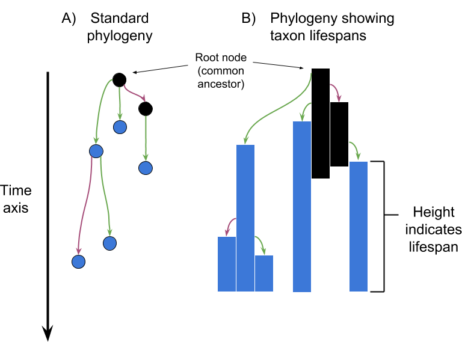

# Interpreting the Tape of Life: Ancestry-based Analyses Provide Insights and Intuition about Evolutionary Dynamics

This repository contains the code, configuration files, analyses, and extra documentation
for the paper ["Interpreting the Tape of Life: 
Ancestry-based Analyses Provide Insights and Intuition about Evolutionary Dynamics"](https://direct.mit.edu/artl/article/26/1/58/93272/Interpreting-the-Tape-of-Life-Ancestry-Based).

Note, this paper is an extension of the paper "Quantifying the tape of life: Ancestry-based metrics provide insights and intuition about evolutionary dynamics" published in the proceedings of [ALIFE 2018](http://2018.alife.org/).

**Navigation:**

<!-- TOC -->

- [Overview](#overview)
  - [Authors](#authors)
  - [Abstract](#abstract)
  - [Repository Contents](#repository-contents)
- [Dependencies](#dependencies)
- [Study Systems](#study-systems)
  - [Niching Competition Benchmark Problems](#niching-competition-benchmark-problems)
  - [Avida Digital Evolution Platform](#avida-digital-evolution-platform)
- [Metric/Visualization Implementations](#metricvisualization-implementations)
- [References](#references)

<!-- /TOC -->

## Overview

In this work, we propose a suite of diagnostic analysis techniques that operate on
lineages and phylogenies in digital evolution experiments. We demonstrate the proposed
suite of analysis techniques in two well-studied contexts: (1) a set of two-dimensional,
real-valued optimization problems from [the GECCO Competition on Niching Methods](https://github.com/mikeagn/CEC2013/), and (2) a set of qualitatively different environments
in the [Avida Digital Evolution Platform](https://avida.devosoft.org/).

Below are the set of lineage and phylogeny analysis techniques discussed in this work. 
Many of these metrics/analysis techniques are drawn from biology, while others are
more specific to digital systems (as they require high-resolution data collection
that can be infeasible in biological systems).

- Lineage-based metrics
  - Lineage length
  - Mutation accumulation
  - Phenotypic volatility
- Phylogeny-based metrics
  - Depth of the most-recent common ancestor (MRCA depth)
  - Phylogenetic richness
  - Phylogenetic divergence
  - Phylogenetic regularity
- Visualizations
  - State sequence visualizations
  - Fitness landscape overlays
  - Phylogenetic trees
  - Muller plots 

For more details on each metric/visualization (including further reading for each),
refer to the paper.

### Authors

- [Emily Dolson](http://emilyldolson.com/)
- [Alexander Lalejini](https://lalejini.com)
- [Steven Jorgensen](https://stevenjorgensen.com/)
- Charles Ofria

### Abstract

> Fine-scale evolutionary dynamics can be challenging to tease out when focused on the broad brush strokes of whole populations over long time spans. We propose a suite of diagnostic analysis techniques that operate on lineages and phylogenies in digital evolution experiments with the aim of improving our capacity to quantitatively explore the nuances of evolutionary histories in digital evolution experiments. We present three types of lineage measurements: lineage length, mutation accumulation, and phenotypic volatility. Additionally, we suggest the adoption of four phylogeny measurements from biology: phylogenetic richness, phylogenetic divergence, phylogenetic regularity, and depth of the most-recent common ancestor. In addition to quantitative metrics, we also discuss several existing data visualizations that are useful for understanding lineages and phylogenies: state sequence visualizations, fitness landscape overlays, phylogenetic trees, and Muller plots. We examine the behavior of these metrics (with the aid of data visualizations) in two well-studied computational contexts: (1) a set of two-dimensional, real-valued optimization problems under a range of mutation rates and selection strengths, and (2) a set of qualitatively different environments in the Avida Digital Evolution Platform.  These results confirm our intuition about how these metrics respond to various evolutionary conditions and indicate their broad value.

### Repository Contents

- **analysis/**:  Directory containing all code used to analyze the data
  - *cec_python_library*: Contains code that depends on the CEC benchmark function Python implementation:
    - cec2013: the Python implementation of the CEC benchmark functions. From [here](https://github.com/mikeagn/CEC2013).
    - data: Precalculated data that the code in cec2013 relies on. From [here](https://github.com/mikeagn/CEC2013).
    - LICENSE.txt: License for the CEC benchmark function implementations.
    - analyze_landscapes.py: A python script to the generate the heat maps and upper and lower bounds data used by the
      webvr visualization.
    - extract_dominant_lineage_info.py: A script to extract data about the dominant lineage from each condition (phenotypic volatility and the full path) post hoc.
- **config/**: Directory contained information about how our experiments were configured.
  - **avida-configs/**: Configurations used for Avida experiments.
  - **optimization-prob-configs/**: Configurations files used in optimization problem experiments.
- **figs/**: Directory containing all figures used in the paper.
- **paper/**: Directory containing bibliography and style files for paper.tex (note that paper.tex has to be at the top level 
   of this repo to appease overleaf)
- **source/**: Directory containing all code that was used to run the experiment.
  - *Makefile*: Contains rules to build the experiment executable.
  - *OptimizationProblemExp.h*: This is where most of the code specific to this experiment lives.
  - *optimization-config.h*: Defines configuration settings for these experiments.
  - *optimization_problems.cc*: Contains all code specific to running this experiment on the command line
     (as opposed to in a web browser)
  - *scripts*: Contains scripts used for wrangling jobs on our High-Performance Computing Cluster.
  - *CEC2013*: Contains the C++ implementation of the CEC benchmark functions. From [here](https://github.com/mikeagn/CEC2013).
- **web/**: Directory containing web implementation (js and html) of our state-sequence visualization, which can be viewed interactively
  [here](http://lalejini.com/interpreting_the_tape_of_life/web/chg_env_lineage.html).
- **paper.tex**: LaTeX code for paper
- **LICENSE**: The MIT license, under which all of our code is available (note: this repository also contains code from the 
    [CEC benchmark functions repository](https://github.com/mikeagn/CEC2013), which is under the FreeBSD license)

## Dependencies

- All of our experiment implementations depend on [Empirical](https://github.com/devosoft/Empirical),
  a library of tools for scientific software development written in C++.
- [The CEC Niching Competition Benchmark Function Library](https://github.com/mikeagn/CEC2013/),
  but we have included the necessary code in this repository for convenience.
- A [modified version of Avida](https://github.com/emilydolson/avida-empirical) that supports the necessary data tracking required
  for our analyses.

## Study Systems

### Niching Competition Benchmark Problems

To gain a broad understanding of our metrics, we applied them to four two-dimensional, real-valued
benchmark optimization problems from the GECCO Competition on Niching Methods: 

- (A) Himmelblau
- (B) Six-Humped Camel Back 
- (C) Shubert
- (D) Composition Function 2 

For each test problem, the X and Y coordinates offered by a given organism are translated by the function into a fitness value. Because of their low dimensionality, we can fully visualize each problem's actual fitness landscape, allowing us to directly view how our ancestry-based metrics respond to the actual paths evolved lineages take through the fitness landscape under different conditions. 

We used the implementations of these problems at [https://github.com/mikeagn/CEC2013](https://github.com/mikeagn/CEC2013) (C++ for fitness calculations during evolution, Python for post-hoc analysis).

### Avida Digital Evolution Platform

Avida is a well-established artificial life system that has been used to study a wide range of evolutionary dynamics.
See (Ofria and Wilke, 2004) for more details on Avida.

The canonical implementation of Avida can be found [here](https://avida.devosoft.org/).
Because some of our metrics required extra data tracking not found in Avida by default,
the Avida implementation used in this work can be found [here](https://github.com/emilydolson/avida-empirical).

We applied our metrics/visualizations to four different environments in Avida:

- (1) a **minimal environment** where selection is entirely focused on the efficiency
  at which organisms replicate
- (2) the **logic-9 environment** where organisms are rewarded for performing all nine
  non-trivial one- and two-input boolean logic functions: NAND, NOT, OR-NOT, AND, OR, AND-NOT, NOR, XOR, and EQUALS.
- (3) the **limited-resource environment** where organisms are rewarded for performing
  nine logic tasks; however, each task is associated with a limited pool of resources.
  When an organism performs a logic task, it collects the appropriate task-associated
  resource in proportion to that resource's current availability and is rewarded
  based on how many resources it has collected.
- (4) the **simple changing environment** cycles between rewarding and punishing
  the NAND and NOT tasks.

For more details about each environment, refer to our paper.

## Metric/Visualization Implementations

- **Lineage/phylogeny metrics:** Our implementations for (most of) the non-trivial lineage and phylogeny metrics are in the 
  [Empirical library](https://github.com/devosoft/Empirical).
- Visualizations
  - **State sequences**: An interactive web app to view the evolved lineages from the changing environment in Avida can be found
    [here](http://lalejini.com/interpreting_the_tape_of_life/web/chg_env_lineage.html). The implementation can be found in the web directory of this repository.
  - **Fitness landscape overlays**: An interactive web app for our fitness landscape overlays can be found [here](https://emilydolson.github.io/fitness_landscape_visualizations/). The implementation can be found [here](https://github.com/emilydolson/fitness_landscape_visualizations).
  - **Phylogenetic trees**: While we didn't show off any phylogenetic tree visualizations in the paper, [here's a link](https://emilydolson.github.io/lineage_viz_tool/standards_viz.html) to a web visualization tool written by us for displaying phylogenies.
  - **Muller plots**: In this work, we used the [ggmuller R package](https://github.com/robjohnnoble/ggmuller)
    to generate Muller plots.

## References

Li, X., Engelbrecht, A., and Epitropakis, M. G. (2013).  Benchmark Functions for CEC’2013 Special Session and Competition on
Niching Methods for Multimodal Function Optimization. Technical report, RMIT University, Australia.

Ofria, C. and Wilke, C. O. (2004).  Avida: A software platform for research in computational evolutionary biology.
Artificial Life, 10(2):191–229.
